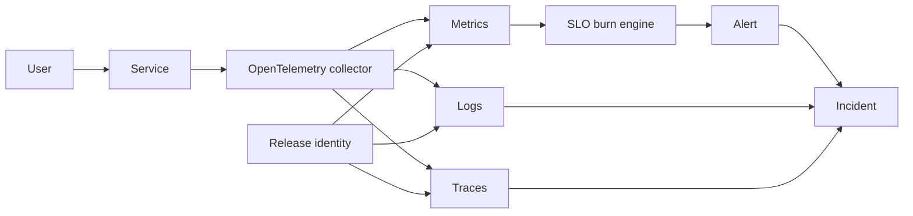

# Observability and SRE Engineering Lab

[](https://github.com/jeevanm84/observability-sre-engineering-lab/actions/workflows/ci.yml)

An executable, local-first laboratory for service-level objectives, error budgets, multi-window burn-rate alerting, telemetry correlation, incident response, and production observability design.

Dashboards are outputs, not the architecture. This repository begins with user outcomes, converts them into machine-checkable SLOs, and proves alert decisions against healthy and failing traffic fixtures.

## Engineering problem

Teams can collect large volumes of metrics, logs, and traces yet fail to answer: Are users affected? How quickly is the budget burning? Which release or dependency changed? Should we page now?



## Quick start

Python 3.11+, Git, and a POSIX shell are sufficient. No cloud account is required.

```bash
./scripts/check.sh
./scripts/evaluate.py --scenario scenarios/healthy.json
./scripts/evaluate.py --scenario scenarios/fast-burn.json
./scripts/demo-incident.sh
```

| Scenario | Availability | Decision |
|---|---:|---|
| Healthy | 99.95% | no page |
| Fast burn | 98.00% | critical page |
| Slow burn | 99.65% | ticket |

## Structure and learning flow

```text
sre/ → SLO mathematics and alert engine
scenarios/ → deterministic healthy and incident evidence
service-catalog/ → ownership, dependencies, SLOs, runbook
prometheus/ and otel/ → production mapping
tests/ and scripts/ → executable proof
labs/ and docs/ → beginner through architect/SRE path
```

Start at [End-to-End Guide](docs/END_TO_END_GUIDE.md), then complete Labs 01–08. Every production review follows:

Problem → Requirements → Architecture → Implementation → Deployment → Security → High Availability → Scalability → Observability → Disaster Recovery → Cost Optimization → Troubleshooting → Lessons Learned

## Portfolio roadmap

[Git](https://github.com/jeevanm84/git-command-master-map) → [AWS](https://github.com/jeevanm84/aws-well-architected-production-labs) → [Terraform](https://github.com/jeevanm84/terraform-aws-ha-web-platform) → [Packer](https://github.com/jeevanm84/packer-aws-golden-image-pipeline) → [Kubernetes](https://github.com/jeevanm84/kubernetes-zero-to-production) → [CI/CD and GitOps](https://github.com/jeevanm84/cicd-gitops-platform-engineering) → **Observability and SRE** → DevSecOps → Troubleshooting → [MjCart](https://github.com/jeevanm84/mjcart-ecommerce-microservices)

The default labs use synthetic aggregate data, create no cloud resources, and contain no production telemetry or personal data.

